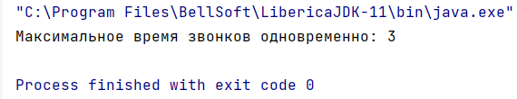

# *Задание*

В колл-центре крупной компании сохраняются логи всех телефонных звонков 
за день. Каждая строка файла лога состоит из времени начала и времени 
окончания одного телефонного разговора, разделенных запятой. Время 
задается в формате POSIX time (количество миллисекунд с 1 января 1970 года).

Строки в файле отсортированы по времени начала разговора.

Необходимо посчитать пиковое количество одновременных разговоров и вы-
вести его на экран. (Максимальное количество разговоров, которые происхо-
дили в одно и то же время.)  
**Пример**  
***[in]***  
1,12  
4,6  
7,12  
10,32  
15,30  

***[out]***  
3

# *Пример запуска*

1) В файл `input.txt` поместите логи, органищованные по оговоренным правилам:  
*Каждая строка файла лога состоит из времени начала и времени
   окончания одного телефонного разговора, разделенных запятой*
2) Запускаем файл `Task10` в его методе `main` находится основная логика работы
3) Вывод будет осуществлен в командную строку,  
на рисунке изображен пример запуска программы с примером из задания
