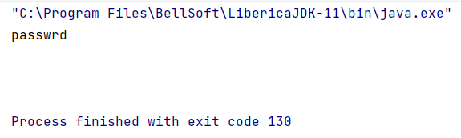

# Пример запуска

1) Запускать файл `Task12`
2) Аргументы при запуске указывать разделя пробелами, без запятых, в стиле:  
`8 40682260CC011947FC2D0B1A927138C5`
3) Запуск с аргементами из примера:  
   