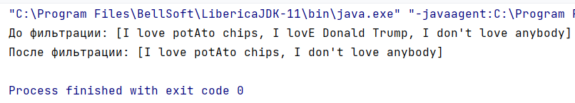

# Задание

Небольшой стартап разрабатывает социальный сервис, в котором пользова-
тели могут оставлять комментарии. Со временем в комментариях появился спам

и разработчики решили бороться с ним с помощью "черных списков" запрещенных
слов. Они составили такие списки и поручили вам написать функцию, удаляющую
из всех накопленных комментариев нежелательные.
Они предоставили вам интерфейс, который внедрили в свой продукт, и
попросили написать его реализацию

# Запуск программы

1. Тестовый пример для запуска расположен в классе `Task13` в `main`
2. Вывод тестового примера  
