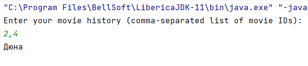

# Запуск программы

1. Запускать необходимо класс `MovieRecommendationSystem`
2. Для примера в файлах history.txt и movies.txt установил параметры из задания
3. Результат работы программы для таких параметров на картинке:  

