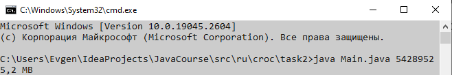

# Задание

Написать метод, форматирующий и выводящий на экран заданный размер в байтах в человекочитаемом виде.

Человекочитаемый вид:

{целая часть < 
<span style="color:blue">**1024**</span>
}.{дробная часть макс. 
<span style="color:blue">**1**</span>
знак} {единица измерения}

# Запуск программы
1. Запускам командную строку в директории с файлом
2. Вводим ```java Main.java {числовой аргумент}```

