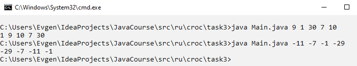

# Задание

Задан массив целых чисел. Необходимо переставить наименьшее из
этих чисел в начало массива, а наибольшее - в конец.

***Входные данные:***  
Элементы массива, по очереди через пробел. Без экранирующих сим-
волов и обозначений начала и конца массива.

# Запуск программы
1. Запускам командную строку в директории с файлом
2. Вводим ```java Main.java {элементы массива}```

