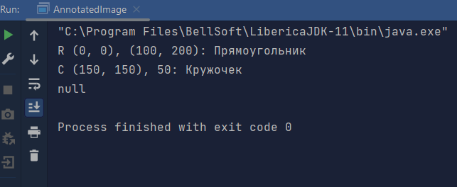

# Задание

Вы разрабатываете небольшое приложение по аннотированию (разметке) изображений с
целью последующего использования этой разметки для обучения моделей computer vision.
В этом приложении пользователь может выделять области на изображении с помощью
прямоугольников и окружностей и подписывать их произвольным текстом. Прямоугольники
определяются координатами левого нижнего и правого верхнего углов, а окружности -
координатами центра и радиусом. Вся разметка для изображения представляется массивом
`Annotation[]`.

В приложении определен класс аннотированного изображения:
```java
class AnnotatedImage { 
    private final String imagePath;
    private final Annotation[] annotations;
    public AnnotatedImage(String imagePath, Annotation... annotations) {
        this.imagePath = imagePath;
        this.annotations = annotations;
    }
    public String getImagePath() {
        return this.imagePath;
    }
    public Annotation[] getAnnotations() {
        return this.annotations;
    }
}
```

Определите класс `Annotation` для представления данных разметки
(подпись + фигура) и классы `Figure`, `Rectangle`, `Circle` для задания
размеченных областей.
Переопределите метод `toString` класса `Annotation` так, чтобы в
результат выводилась информация о полях и вложенных объектах. 
*Формата вывода:*  
***Окружность:***  
`“C (<X0>, <Y0>), <R>: <Подпись>”`  
***Прямоугольник:***  
`“R (<X1>, <Y1>), (<X2>, <Y2>): <Подпись>”`  
***Например:***  
`C (100, 100), 10: Tree`  
`R (100, 100), (150, 200): Car`

Для поддержки новой
функциональности вам требуется внести несколько изменений:
1) выбор аннотации по координатам точки (x, y);
   В массиве аннотаций требуется найти первую, фигура которой содержит
   точку с заданными координатами.
   ```
   Annotation findByPoint(int x, int y) {
   // ...
   }
   ```
2) выбор аннотации по шаблону подписи;
   В массиве аннотаций требуется найти первую, подпись которой
   содержит заданную подстроку.
   ```
   Annotation findByLabel(String label) {
   // ...
   }
   ```
   Определить, содержит ли строка заданную подстроку, можно с помощью
   метода contains(CharSequence s) класса String.
3) перемещение фигуры выбранной аннотации на смещение (dx, dy);
   В рамках этого изменения вы решили доработать классы фигур таким
   образом, чтобы они реализовывали интерфейс
```
    public interface Movable {
    void move(int dx, int dy);
    }
```
Доработайте классы и реализуйте соответствующие методы.

# Пример запуска

Запускать необходимо класс `AnnotatedImage`, в его методе `main` я
в качестве примера создал 2 аннотации с разным типом фигур и использовал 
на них все три реализованных метода

