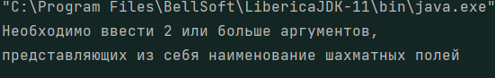
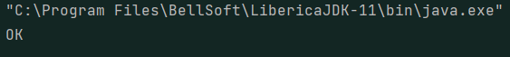
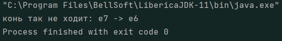

# Пример запуска

1) Запускать файл `ChessPosition`
2) Аргументы при запуске указывать разделя пробелами, без запятых, в стиле:  
`a1 c7 b2 h6`
3) Запуск без аргументов:  
   
4) Запуск с аргументами `g8 e7 c8`  
   
5) Запуск с аргументами `g8 e7 e6 c7`  
   