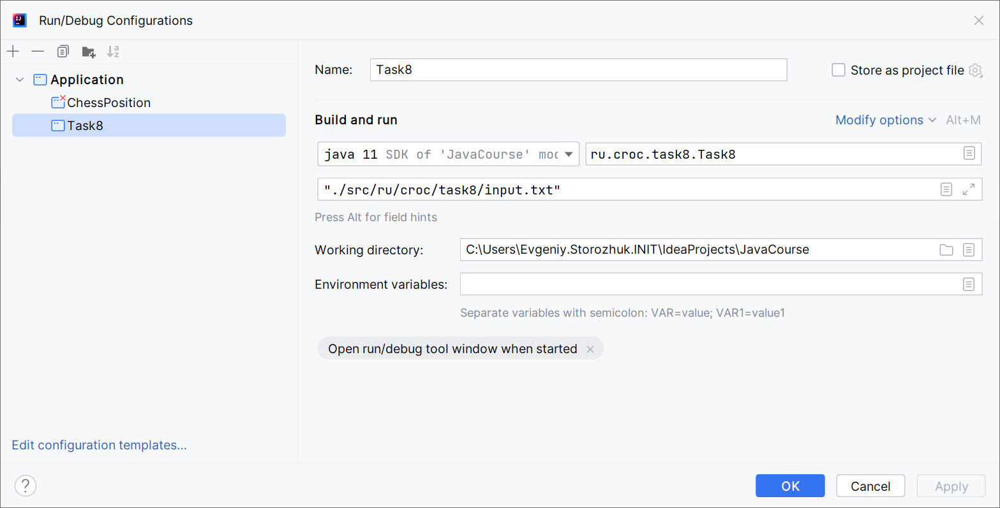
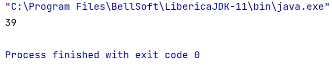

# Задание
Посчитать кол-во слов в файле  
Цифры и нижние подчеркивания я тоже считал словами, в задании не совсем явно определено что считать словом
# Запуск программы

1. Пример аргументов передаваемых в программу: `"./src/ru/croc/task8/input.txt"`

2. Пример вывода  
