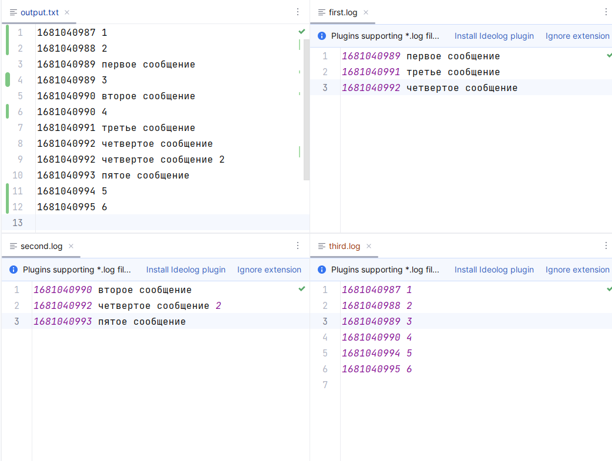

# Задание

Вы разрабатываете систему в микросервисной архитектуре, в которой сервисы
в процессе работы записывают логи в отдельные файлы. Каждая строка файла
лога имеет вид:  
`time message\n`  
где `time` - время в формате POSIX time (количество миллисекунд с 
1 января 1970 года), `message` - произвольный текст.

Строки в логах всегда отсортированы по времени в порядке возрастания.

Сервисов в системе много, и вы обнаружили, что при анализе ошибок
тратите слишком много времени, так как приходится восстанавливать
общий порядок действий в системе по большому количеству разных логов.

Поэтому вы решили реализовать утилиту слияния нескольких логов в один
общий. Утилита в качестве аргумента командной строки принимает путь к 
директории, в которой находятся файлы логов (возможно, разбитые по 
вложенным директориям). Результат слияния утилита записывает в стандартный 
поток вывода в виде общей последовательности строк из всех логов в порядке 
возрастания времени. Логами считаются файлы с расширениями .log или
.trace, все файлы с другими расширениями игнорируются. 

Реализуйте эту утилиту, имея в виду, что логи бывают большими и не 
всегда могут поместиться в оперативной памяти целиком.

# Запуск программы

1. Запускаем `Task9`, указав в аргументах путь к папке с логами, например `".\src\ru\croc\task9\logs"`
2. Слияние логов поместится в эту же папку, в файл `output.txt`
3. Пример запуска программы с конфигурацией файлов можно увидеть на рисунке ниже или в самом проекте, по пути `src\ru\croc\task9\logs` 

